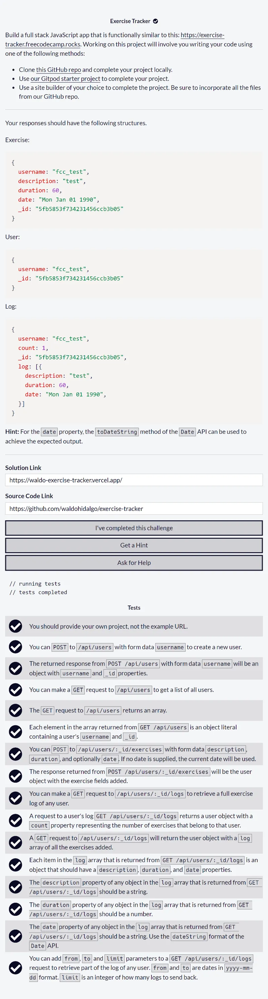
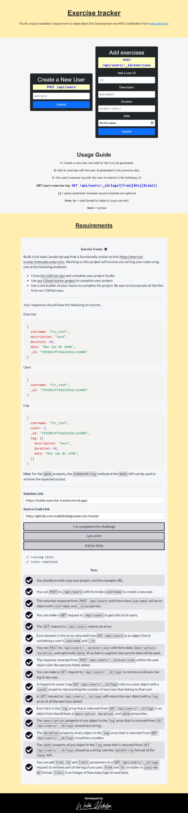
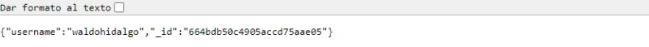
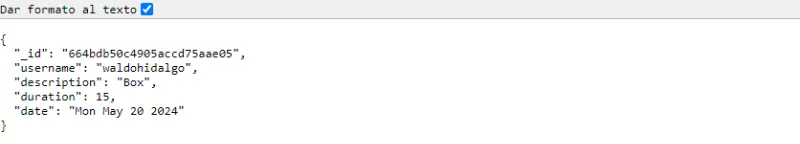
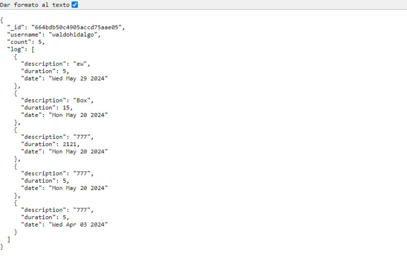

# Exercise Tracker

Repositorio con mi código solución al cuarto proyecto requisito obligatorio llamado [Exercise Tracker](https://www.freecodecamp.org/learn/apis-and-microservices/apis-and-microservices-projects/exercise-tracker) de freecodecamp con el objetivo de obtener la **Back End Development and APIs Certification**.

## Tabla de Contenido

- [Exercise Tracker](#exercise-tracker)
  - [Tabla de Contenido](#tabla-de-contenido)
  - [Requisitos](#requisitos)
  - [Screenshots](#screenshots)
    - [1. Home Page](#1-home-page)
    - [2. Creación de Usuario](#2-creación-de-usuario)
    - [3. Creación de nuevo ejercicio](#3-creación-de-nuevo-ejercicio)
    - [4. Logs de ejercicios creados para el usuario ingresado](#4-logs-de-ejercicios-creados-para-el-usuario-ingresado)

## Requisitos

## Screenshots

### 1. Home Page

### 2. Creación de Usuario

En caso de que el usuario no exista en la base de datos, se procede a crear un nuevo usuario y en caso de que el usuario ya exista, se procede a devolver la data almacenada para dicho usuario.

### 3. Creación de nuevo ejercicio

### 4. Logs de ejercicios creados para el usuario ingresado

